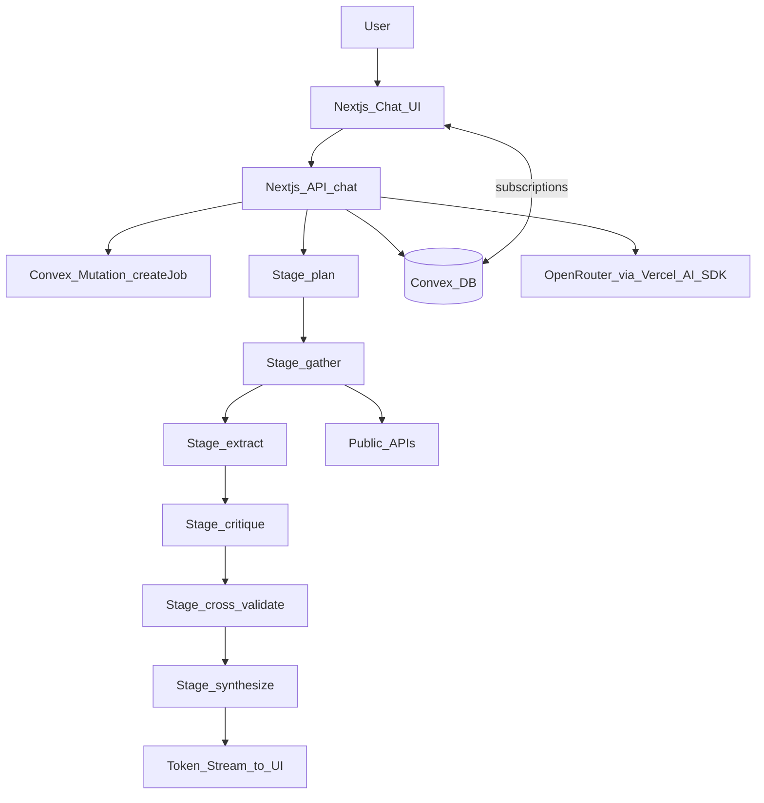

# Overall Architecture + Agents Plan

## Goal

Document and implement the overall system architecture for a minimal-stack research synthesizer:

- Next.js chat-first UI for creating and observing research runs
- Convex as the only database + realtime layer
- A chat-primary, durable multi-stage workflow runner (agents/steps)
- Vercel AI SDK calling OpenRouter for models
- End-to-end citation guardrails (no invented sources)

## System overview (data + control flow)

## Main components and responsibilities

### Next.js app

- **Chat page** is the primary UX surface and subscribes to Convex for durable updates.
- **Chat route handler** is the primary runtime for:
  - starting/continuing research runs
  - streaming token output to the UI
  - hiding provider keys (OpenRouter)
  - persisting stage/events/artifacts to Convex during streaming
- Suggested entrypoints:
  - `[app/api/chat/route.ts](app/api/chat/route.ts)` primary stream + orchestration endpoint
  - `[app/page.tsx](app/page.tsx)` chat-first UI
  - report/history routes as secondary drill-downs

### Convex

- **Tables** store jobs, events, and artifacts.
- **Queries** power UI subscriptions.
- **Mutations** create jobs, append events, persist artifacts.
- **Actions** run the workflow because they can call external APIs + LLM.

### LLM access layer (Vercel AI SDK + OpenRouter)

- Single wrapper module provides:
  - model registry (e.g. fast/standard/deep)
  - structured output schemas (Zod) for each stage
  - consistent retry/timeouts and logging
- Suggested module:
  - `[lib/ai](lib/ai)` (model config + helpers)

## Workflow design (durable stages)

### Stages (state machine)

Use a small explicit state machine with a fixed stage order:

- `plan` → `gather` → `extract` → `critique` → `cross_validate` → `synthesize`

Each stage:

- **Reads**: prior artifacts from Convex
- **Writes**:
  - new artifacts (documents/passages/claims/citations/report)
  - `jobEvents` for progress
  - job state updates (`currentStage`, `status`, timestamps)

### Execution model

- **MVP**: one Next.js chat request orchestrates the stage sequence and streams synthesis tokens.
- **Durability**: each stage writes to Convex as it executes so reconnects/reloads remain correct.
- **Scale-up** (if time limits appear): stage-level Convex scheduled jobs become the background executor while `/api/chat` remains the UX stream coordinator.

### Idempotency and re-runs

- Reruns should not duplicate artifacts unnecessarily:
  - document upserts by `jobId+url` (app-layer uniqueness)
  - passages/claims/citations can be regenerated per rerun with a `runId` or by clearing stage-specific artifacts (later)
- Define behavior for:
  - **cancel**: stop scheduling next stages; mark job cancelled
  - **resume**: re-enter at currentStage
  - **retry**: rerun failed stage with backoff

## Agent/step contracts (inputs/outputs)

### Planner

- **Input**: job question + config.
- **Output (structured)**:
  - sub-questions
  - search terms per source
  - per-stage limits (maxDocs, maxPassages)
- **Writes**:
  - events (`planned N queries`)
  - optional `plan` artifact (can be embedded in job config or a dedicated table later)

### Gather (per source)

- **Input**: plan search terms + source config.
- **Output**: normalized `documents`.
- **Writes**:
  - documents rows
  - events for each fetch

### Extract

- **Input**: documents.
- **Output (structured)**:
  - passages (docId + quote + locator + relevance)
  - initial claims list
- **Writes**:
  - passages rows
  - claims rows

### Critique

- **Input**: claims + passages.
- **Output (structured)**:
  - claim status updates (supported/contested/unknown)
  - missing counterarguments and questions to validate
- **Writes**:
  - claim status/notes updates
  - events

### Cross-validate

- **Input**: top claims + critic questions.
- **Output**:
  - additional documents/passages
  - citations linking claims to evidence
  - contested flags if contradictory sources found
- **Writes**:
  - citations rows (must include verbatim `quote` + locator)
  - optional new documents/passages

### Synthesizer

- **Input**: claims + citations + supporting passages.
- **Output**:
  - `reportMd`
  - `reportJson` referencing claimIds and citationIds
- **Hard constraint**:
  - synthesizer can only cite existing `citations` rows (no raw URL invention)

## Citation guardrails (architecture-level)

- Enforce guardrails at the workflow boundary:
  - stage outputs must reference Convex IDs (docId/claimId/citationId)
  - synthesis step must fail closed if citations are missing
- UI should display evidence first-class:
  - every citation → quote + locator + source URL

## Observability and debuggability

- `jobEvents` is the single source for progress.
- Stream trace IDs should map token stream events to durable `jobEvents` for diagnosis.
- Ensure consistent event shapes per stage:
  - stage start/finish
  - counts (docs/passages/claims/citations)
  - warnings (rate limits, partial failures)

## Suggested code layout

- Next.js:
  - `[app](app)` routes/pages
  - `[components](components)` UI components
- Convex:
  - `[convex/schema.ts](convex/schema.ts)`
  - `[convex/jobs.ts](convex/jobs.ts)` job/event queries/mutations
- Workflow:
  - `[app/api/chat/route.ts](app/api/chat/route.ts)` stream transport + orchestration entrypoint
  - `[lib/workflow](lib/workflow)` stage functions + Zod schemas
  - `[lib/sources](lib/sources)` connectors (wikipedia/arxiv)
  - `[lib/ai](lib/ai)` model registry + structured generation helpers

## Test plan (manual, end-to-end)

- Send a new research chat prompt and verify token stream begins immediately.
- Verify stages advance in order and are durably persisted in Convex.
- Confirm documents/passages/claims/citations are persisted and queryable.
- Confirm report cites only stored citations; remove citations and ensure synth fails closed.
- Confirm refresh/reconnect preserves run state and no duplicate runs are created.

