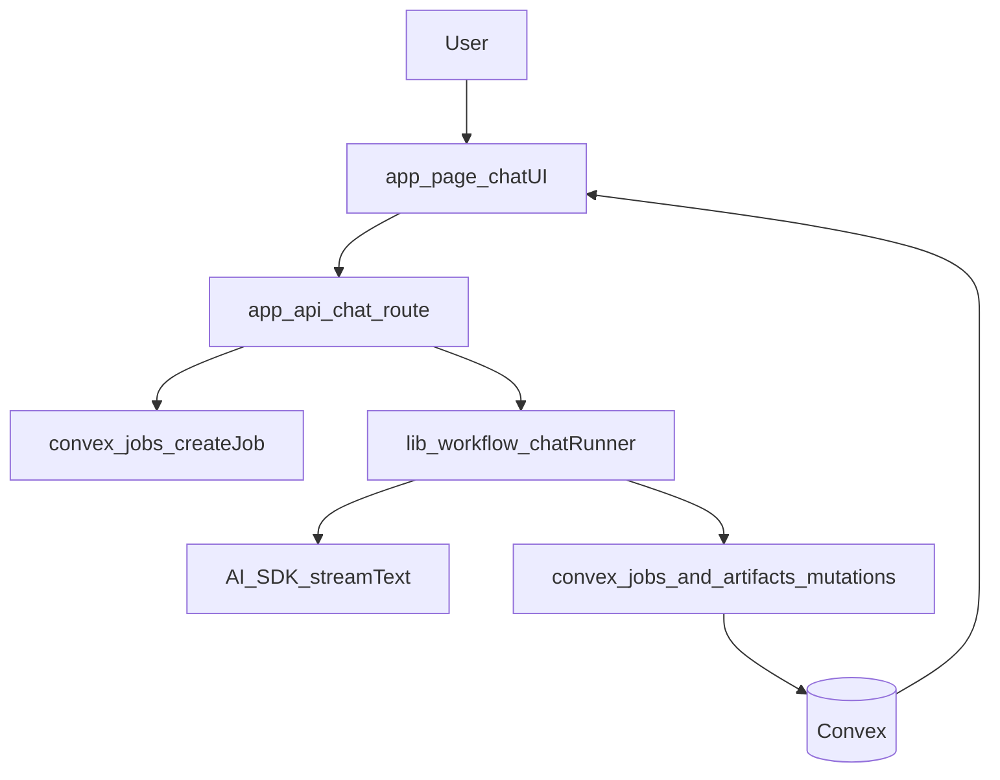

# Chat-First Research Streaming Plan

## Goal

Make the primary experience a single chat interface where users start new research, see all progress in-chat, and receive real-time token streaming for the assistant response.

## Chosen Architecture

- Primary orchestration and stream transport lives in a Next.js chat route (`/api/chat`).
- Convex remains the source of truth for durable job state, stage events, and artifacts.
- The UI renders both token stream output and persisted stage/artifact updates in one chat timeline.

## Implementation Steps

### 1) Build a chat-first home screen

- Replace the starter content in [c:\Users\syeda\OneDrive\Desktop\Syed\Dev\research-synthesizer\app\page.tsx](c:\Users\syeda\OneDrive\Desktop\Syed\Dev\research-synthesizer\app\page.tsx) with a single research chat surface.
- Reuse AI Elements already present in [c:\Users\syeda\OneDrive\Desktop\Syed\Dev\research-synthesizer\components\ai-elements\message.tsx](c:\Users\syeda\OneDrive\Desktop\Syed\Dev\research-synthesizer\components\ai-elements\message.tsx), [c:\Users\syeda\OneDrive\Desktop\Syed\Dev\research-synthesizer\components\ai-elements\prompt-input.tsx](c:\Users\syeda\OneDrive\Desktop\Syed\Dev\research-synthesizer\components\ai-elements\prompt-input.tsx), [c:\Users\syeda\OneDrive\Desktop\Syed\Dev\research-synthesizer\components\ai-elements\tool.tsx](c:\Users\syeda\OneDrive\Desktop\Syed\Dev\research-synthesizer\components\ai-elements\tool.tsx), and [c:\Users\syeda\OneDrive\Desktop\Syed\Dev\research-synthesizer\components\ai-elements\reasoning.tsx](c:\Users\syeda\OneDrive\Desktop\Syed\Dev\research-synthesizer\components\ai-elements\reasoning.tsx) to render user/assistant/tool/state parts.
- Keep “new research” as the first user message in the chat (no separate form-first page).

### 2) Add Next.js streaming chat endpoint as the primary runtime

- Create [c:\Users\syeda\OneDrive\Desktop\Syed\Dev\research-synthesizer\app\api\chat\route.ts](c:\Users\syeda\OneDrive\Desktop\Syed\Dev\research-synthesizer\app\api\chat\route.ts).
- Use AI SDK streaming (`streamText`) to emit token-by-token assistant output for synthesis.
- In the same request lifecycle, create/manage research jobs in Convex via existing mutations in [c:\Users\syeda\OneDrive\Desktop\Syed\Dev\research-synthesizer\convex\jobs.ts](c:\Users\syeda\OneDrive\Desktop\Syed\Dev\research-synthesizer\convex\jobs.ts) and artifact writes in [c:\Users\syeda\OneDrive\Desktop\Syed\Dev\research-synthesizer\convex\artifacts.ts](c:\Users\syeda\OneDrive\Desktop\Syed\Dev\research-synthesizer\convex\artifacts.ts).
- Standardize tool/event payload shape so stage events become structured chat parts (status, counts, citations, warnings).

### 3) Introduce a chat-oriented workflow runner layer

- Add `lib/workflow` modules that map existing stage contracts from [c:\Users\syeda\OneDrive\Desktop\Syed\Dev\research-synthesizer\lib\ai\contracts.ts](c:\Users\syeda\OneDrive\Desktop\Syed\Dev\research-synthesizer\lib\ai\contracts.ts) into chat stream events.
- Emit stage lifecycle checkpoints (`plan/gather/extract/critique/cross_validate/synthesize`) both:
  - to Convex (`appendEvent` / status updates), and
  - to the live stream as assistant tool/status parts.
- Keep retrieval integration via [c:\Users\syeda\OneDrive\Desktop\Syed\Dev\research-synthesizer\convex\retrieval.ts](c:\Users\syeda\OneDrive\Desktop\Syed\Dev\research-synthesizer\convex\retrieval.ts), but route orchestration from the new chat runtime.

### 4) Rewire job model for chat sessions

- Extend schema in [c:\Users\syeda\OneDrive\Desktop\Syed\Dev\research-synthesizer\convex\schema.ts](c:\Users\syeda\OneDrive\Desktop\Syed\Dev\research-synthesizer\convex\schema.ts) with chat linkage (e.g., `threadId`, `messageId`, `runId`) so one chat can contain multiple research runs.
- Add Convex queries for chat timeline hydration (recent runs/events/artifacts grouped per run) and reconnect behavior after refresh.
- Preserve backward compatibility for existing `listJobs`/`listJobEvents` while adding chat-first access patterns.

### 5) Unify UI timeline from two realtime sources

- Render immediate token stream from `/api/chat` as the live assistant response.
- In parallel, subscribe to Convex events/artifacts for durable updates and merge them into the same message timeline (dedupe by run/message IDs).
- Ensure interruptions and errors surface inline in chat (cancelled run, failed stage, partial outputs).

### 6) Clean up old page-oriented plan assumptions

- Deprioritize separate “Run/Report/History-first” routes in favor of the chat homepage as entrypoint.
- Keep report/history views as secondary drill-downs linked from chat messages.
- Update app metadata and shell basics in [c:\Users\syeda\OneDrive\Desktop\Syed\Dev\research-synthesizer\app\layout.tsx](c:\Users\syeda\OneDrive\Desktop\Syed\Dev\research-synthesizer\app\layout.tsx) for product naming once chat UI is in place.

## Validation

- Starting a new research prompt creates a job and immediately streams assistant output token-by-token.
- Stage transitions and artifact counts appear in-chat without refresh.
- Reloading the page restores prior chat/run context from Convex.
- Final synthesized answer and citations remain consistent with persisted Convex artifacts.

