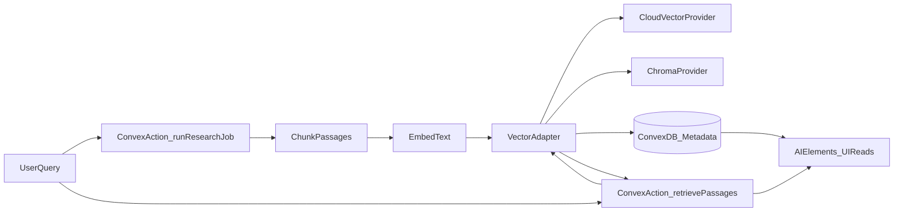

# Convex Schema Plan Update (External Vectors + AI Elements)

## Goal

Define a durable, query-friendly Convex schema that supports:

- Long-running, multi-stage research jobs
- Real-time progress/event streaming to the UI
- Artifact persistence (documents -> passages -> claims -> citations -> report)
- Strict citation guardrails (no report claim without stored evidence)

And update retrieval architecture so semantic search **does not use Convex built-in vector search**. Convex remains the system of record for jobs/events/artifacts, while embeddings and ANN search live in a pluggable external vector backend (managed cloud option or ChromaDB).

## Scope changes from current plan

- Keep core Convex entities: `researchJobs`, `jobEvents`, `documents`, `passages`, `claims`, `citations`, `reports`.
- Add external vector synchronization contracts for `passages` (and optional `documents` summaries).
- Add adapter boundary so runtime can switch between:
  - managed cloud vector DB (e.g. Pinecone/Qdrant/Weaviate/pgvector service)
  - self-hosted or cloud ChromaDB
- Add UI-facing retrieval shape compatible with AI Elements components already present in `[components/ai-elements](components/ai-elements)`.

## Target files to update/create in implementation

- `[.cursor/plans/convex_schema_(deep)_6bb9aaf8.plan.md](.cursor/plans/convex_schema_(deep)_6bb9aaf8.plan.md)` (replace with this updated plan content)
- `[convex/schema.ts](convex/schema.ts)` (schema tables/indexes; no Convex vector index usage)
- `[convex/jobs.ts](convex/jobs.ts)` (job lifecycle + event feed queries)
- `[convex/artifacts.ts](convex/artifacts.ts)` (artifact CRUD + retrieval metadata reads)
- `[convex/retrieval.ts](convex/retrieval.ts)` (Convex action/query entrypoints for semantic retrieval orchestration)
- `[lib/vector/types.ts](lib/vector/types.ts)` (shared interfaces)
- `[lib/vector/providers/chroma.ts](lib/vector/providers/chroma.ts)`
- `[lib/vector/providers/cloud.ts](lib/vector/providers/cloud.ts)`
- `[lib/vector/index.ts](lib/vector/index.ts)` (provider factory)
- `[lib/ai/contracts.ts](lib/ai/contracts.ts)` (typed payloads consumed by AI Elements UI)

## Core entities and relationships

### `researchJobs`

**Purpose**: durable job root and execution state.

- **Fields** (suggested):
  - `question: string`
  - `status: "queued" | "running" | "succeeded" | "failed" | "cancelled"`
  - `currentStage: StageName` (see Shared types)
  - `config`: `{ depthPreset, sourcesEnabled, model, limits }`
  - `error?: { stage, message, code? }`
  - `createdAt, startedAt?, finishedAt?`: numbers (ms)
  - `ownerId?`: string (optional for future auth)
- **Indexes**:
  - by `status`
  - by `createdAt` (for history)
  - by `ownerId + createdAt` (if multi-user)
- **Notes**:
  - keep config minimal but explicit; avoid free-form JSON blobs that you cannot query.

### `jobEvents`

**Purpose**: append-only timeline for realtime UI.

- **Fields**:
  - `jobId: Id<"researchJobs">`
  - `ts: number`
  - `stage: StageName`
  - `level: "debug" | "info" | "warn" | "error"`
  - `message: string`
  - `payload?`: small JSON (avoid huge blobs; store big artifacts in dedicated tables)
- **Indexes**:
  - by `jobId + ts` (primary feed)
  - by `jobId + stage + ts` (stage filter)
- **Retention**:
  - optional pruning policy later; MVP can keep all events.
- **External retrieval events**:
  - include retrieval/index lifecycle event types (`embedding_started`, `embedding_indexed`, `retrieval_hit`) in payload conventions.

### `documents`

**Purpose**: normalized fetched sources.

- **Fields**:
  - `jobId: Id<"researchJobs">`
  - `sourceType: "wikipedia" | "arxiv" | "news" | "gov" | "web"`
  - `url: string`
  - `title?: string`
  - `fetchedAt: number`
  - `text: string` (raw extracted text; consider size limits)
  - `metadata`: `{ authors?, publishedAt?, doi?, arxivId?, wikiPageId?, language?, ... }`
  - `contentHash?`: string (dedupe)
  - `chunkingVersion?`: string (optional, for reproducible chunking/indexing)
  - `embeddingModel?`: string (optional, for reproducible retrieval)
- **Indexes**:
  - by `jobId + sourceType`
  - by `jobId + url`
  - optional by `contentHash`
- **Guardrails**:
  - ensure `url` is always present for citation linking.

### `passages`

**Purpose**: smaller evidence chunks derived from documents.

- **Fields**:
  - `jobId: Id<"researchJobs">`
  - `documentId: Id<"documents">`
  - `text: string`
  - `locator`: `{ kind: "section" | "offset" | "page" | "unknown", value?: string }`
  - `relevanceScore?: number`
  - `createdAt: number`
  - `embeddingStatus?: "pending" | "indexed" | "failed"`
  - `vectorProvider?: "cloud" | "chroma"`
  - `vectorNamespace?: string` (typically job scoped)
  - `externalVectorId?: string`
  - `lastIndexedAt?: number`
- **Indexes**:
  - by `jobId + documentId`
  - by `jobId + relevanceScore` (optional ranking view)
  - by `jobId + embeddingStatus` (indexing/backfill visibility)
- **Notes**:
  - keep passage text small enough to display quickly and quote safely.
  - Convex stores passage metadata/text; ANN lives outside Convex.

### `claims`

**Purpose**: canonical list of extracted claims to be supported/contested.

- **Fields**:
  - `jobId: Id<"researchJobs">`
  - `claim: string`
  - `status: "supported" | "contested" | "unknown"`
  - `notes?`: string (critic notes)
  - `createdAt: number`
- **Indexes**:
  - by `jobId + status`
  - by `jobId + createdAt`

### `citations`

**Purpose**: evidence edges connecting claims to documents (+ exact quote).

- **Fields**:
  - `jobId: Id<"researchJobs">`
  - `claimId: Id<"claims">`
  - `documentId: Id<"documents">`
  - `url: string` (duplicate for convenience; should match `documents.url`)
  - `quote: string` (verbatim excerpt)
  - `locator`: same shape as passages
  - `createdAt: number`
- **Indexes**:
  - by `jobId + claimId`
  - by `jobId + documentId`
- **Critical guardrails**:
  - synthesis step must only cite existing `citations` rows.
  - require `quote` to be non-empty and a substring (or near-substring) of the parent document/passages (enforce later).

### `reports`

**Purpose**: final output + structured form.

- **Fields**:
  - `jobId: Id<"researchJobs">`
  - `reportMd: string`
  - `reportJson`: structured representation (sections + claim refs + citation refs)
  - `createdAt: number`
- **Indexes**:
  - by `jobId`
- **Notes**:
  - prefer `reportJson` that references `claimId` and `citationId` rather than raw URLs.

## External vector architecture (replaces Convex built-in vectors)

Retain existing tables and add external-vector linkage fields:

Keep Convex indexes focused on metadata/query UX (`jobId+createdAt`, `jobId+status`, etc.), not ANN.

### Adapter contract

Define one provider-neutral interface:

- `upsertPassages(jobId, passagesWithEmbeddings)`
- `querySimilar(jobId, queryEmbedding, topK, filters)`
- `deleteNamespace(jobId)`
- `healthcheck()`

Provider-specific concerns (collection creation, metadata filters, batching, retries) stay inside adapters.

## Shared types

- `StageName` enum/union used across schema + events:
  - `"plan" | "gather" | "extract" | "critique" | "cross_validate" | "synthesize"`
- Config types to keep UI and backend consistent:
  - depth preset (`fast|standard|deep`)
  - limits (`maxDocs`, `maxPassagesPerDoc`, etc.)
  - selected model id
- Vector provider types:
  - `VectorProvider = "cloud" | "chroma"`
  - retrieval hit shape includes `documentId`, `url`, `title`, `quote`, `locator`, `score`

## AI Elements compatibility requirements

Because the UI currently centers on AI Elements primitives, retrieval responses should map directly to reusable components:

- `sources`/`inline-citation` compatibility:
  - each hit must return `documentId`, `url`, `title`, `quote`, `locator`, `score`
- `reasoning`/`plan` timeline compatibility:
  - retrieval/index lifecycle events emitted into `jobEvents`
- `artifact`/`message` composition:
  - expose canonical `EvidenceItem` and `ClaimWithEvidence` contracts in `[lib/ai/contracts.ts](lib/ai/contracts.ts)`

## Query patterns to support UI

- **History**: list jobs ordered by `createdAt` (optionally filtered by owner)
- **Run page**:
  - job header (`status/currentStage`)
  - event feed (`jobId + ts`)
  - docs list (`jobId`)
  - claims list (`jobId`, optionally by status)
- **Report page**:
  - report by `jobId`
  - citations by `claimId` (for evidence drawer)
- **Retrieval-aware views**:
  - pending/failed indexing passages by `jobId + embeddingStatus`
  - optional debug stream for retrieval hits in `jobEvents`

## Runtime configuration

Use environment-driven provider selection:

- `VECTOR_PROVIDER=cloud|chroma`
- `EMBEDDING_MODEL=...`
- `VECTOR_TOP_K=...`
- Chroma-specific: URL, tenant/db/collection config
- Cloud-specific: endpoint/key/index/namespace settings

Add startup validation that fails fast when selected provider env vars are missing.

## Guardrails and consistency

- Convex remains source-of-truth for authored artifacts and citations.
- Every report citation must resolve to stored `citations` row and linked `document`.
- Retrieval hits used during synthesis should store provenance in `jobEvents` and optionally `claims` notes.
- Add idempotent indexing: skip passages where `externalVectorId` already exists unless forced reindex.

## Data lifecycle rules

- **Append-only where possible**:
  - events always append
  - documents append per gather
  - passages append per extract
  - claims append per extract; critic/xval can update status/notes
- **Idempotency**:
  - enforce `jobId+url` uniqueness at the application layer (Convex does not do unique constraints); use `contentHash` or check-before-insert.
  - for vectors, use deterministic external IDs per passage to support safe re-upsert.
- **Cleanup** (future):
  - optional delete job cascade helpers in Convex and matching vector namespace deletion helpers.

## Validation and size considerations

- Convex doc size limits mean:
  - keep `documents.text` bounded (truncate or store only relevant sections)
  - avoid huge `payload` in events; store artifacts in dedicated tables
- Keep `quote` and `passage.text` small (e.g., <= ~1-2k chars) for fast UI rendering.
- Keep vector metadata compact; store full text canonically in Convex and only minimal metadata in vector backend.

## Rollout strategy

1. Implement schema + adapter layer with provider flag.
2. Default local/dev to ChromaDB; staging/prod to managed cloud provider.
3. Add backfill action to index existing passages.
4. Switch retrieval stage to external providers; keep old API surface stable for UI.
5. Validate claim→citation traceability end-to-end.

## Migration strategy

- Start with MVP tables above (including optional vector linkage fields).
- When adding new sources or fields, prefer additive changes.
- Write a one-off migration/backfill action only if existing passages need indexing; otherwise handle missing fields defensively.

## Test plan (schema + queries + retrieval)

- Create job -> insert events -> query feed ordered by `ts`.
- Insert docs/passages/claims/citations; verify indexes support fast per-job reads.
- Confirm report can reference citations deterministically.
- Verify no Convex vector API usage in pipeline.
- Run indexing with `VECTOR_PROVIDER=chroma`; confirm `embeddingStatus=indexed` and non-empty `externalVectorId`.
- Repeat with `VECTOR_PROVIDER=cloud`; confirm same read contracts.
- Execute retrieval and ensure AI Elements-facing payload includes citation fields (`url`, `quote`, `locator`, `score`).
- Verify report generation still enforces citation guardrails.
