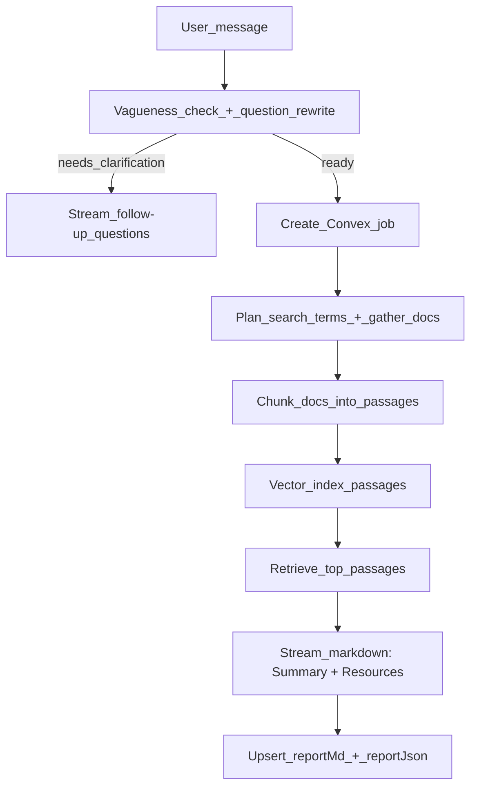

# Resource-first AI + clarification flow

## What will change

- The chat endpoint will **either**:
  - ask **follow-up clarification questions** (and stop, no search yet), **or**
  - run a lightweight retrieval workflow that produces **(1) a concise summary** and **(2) a ranked list of resources**.

This replaces the current full pipeline that generates claims + cross-validated citation IDs.

## Current implementation touchpoints (so changes are precise)

- Chat endpoint: `[app/api/chat/route.ts](c:/Users/syeda/OneDrive/Desktop/Syed/Dev/research-synthesizer/app/api/chat/route.ts)`
  - Today it always creates a Convex job and runs `runWorkflowUntilSynthesis(...)`, then streams `streamSynthesisText(...)`.
- Workflow pipeline: `[lib/workflow/runner.ts](c:/Users/syeda/OneDrive/Desktop/Syed/Dev/research-synthesizer/lib/workflow/runner.ts)`
  - Already has plan + gather + passage chunking helpers; also already runs vector indexing.
- Retrieval API (already implemented): `[convex/retrieval.ts](c:/Users/syeda/OneDrive/Desktop/Syed/Dev/research-synthesizer/convex/retrieval.ts)`
  - `retrievePassages({ jobId, queryText, topK })` returns ranked `EvidenceItem[]` with `url`, `title`, `quote`, `score`, `sourceType`.
- UI entry: `[components/research-chat.tsx](c:/Users/syeda/OneDrive/Desktop/Syed/Dev/research-synthesizer/components/research-chat.tsx)`
  - Currently renders assistant output as markdown text only; we can keep that and simply include “Summary + Resources” in markdown.

## New flow (high-level)

## Implementation details (concrete)

### 1) Add “clarify or proceed” decision step

- Add a small structured LLM call (via existing `generateStructured(...)` in `[lib/ai/openrouter.ts](c:/Users/syeda/OneDrive/Desktop/Syed/Dev/research-synthesizer/lib/ai/openrouter.ts)`) that takes:
  - the last user question, plus a compact view of recent conversation turns
- Output:
  - `decision: "clarify" | "proceed"`
  - `followUpQuestions: string[]` (when clarify)
  - `refinedQuestion: string` (when proceed)

Where:

- New helper module: `lib/ai/clarify.ts` (new)
- Called from `[app/api/chat/route.ts](c:/Users/syeda/OneDrive/Desktop/Syed/Dev/research-synthesizer/app/api/chat/route.ts)` right after `question` extraction.

Behavior:

- If `decision === "clarify"`: return a streaming assistant message that asks the follow-ups and instructs the user to answer them in one reply. **Do not create a Convex job.**

### 2) Implement a lightweight “resources-first” workflow runner

- In `[lib/workflow/runner.ts](c:/Users/syeda/OneDrive/Desktop/Syed/Dev/research-synthesizer/lib/workflow/runner.ts)`, add a new exported function:
  - `runWorkflowForResources({ convex, jobId, config, question, runId, threadId })`

It will:

- reuse existing `runPlanStage` and `runGatherStage` to fetch documents
- query gathered docs via `api.artifacts.listDocumentsByJob`
- create passages by chunking doc text (reuse `splitIntoCandidatePassages`) and calling `api.artifacts.createPassages`
- run indexing: `api.retrieval.backfillPassagesForJob({ jobId })`
- retrieve ranked hits: `api.retrieval.retrievePassages({ jobId, queryText: refinedQuestion, topK })`
- return `{ refinedQuestion, hits }`

### 3) Stream the new response shape: “Summary + Resources”

- In `[app/api/chat/route.ts](c:/Users/syeda/OneDrive/Desktop/Syed/Dev/research-synthesizer/app/api/chat/route.ts)`:
  - replace `runWorkflowUntilSynthesis(...)` with `runWorkflowForResources(...)`
  - build a prompt that includes:
    - the refined question
    - the top retrieved hits (url/title/sourceType/score + short quote)
  - stream markdown output with an explicit structure:
  - `## Summary`
  - `## Resources` (ranked bullet list with clickable URLs)
  - `## Limits & Unknowns`
- Persist the final markdown to Convex `reports` as today.
- Store a richer `reportJson` (still `any` in schema) such as:
  - `{ refinedQuestion, resources: [{url,title,sourceType,score,quote}], generatedAt }`

### 4) UI: keep it simple, optionally upgrade display

Minimum (no new UI work required):

- Since the assistant message and the durable report are both markdown-rendered (`<MessageResponse>`), users will see the **Summary + Resources** immediately.

Optional (small upgrade using existing AI Elements):

- Update `[components/research-chat.tsx](c:/Users/syeda/OneDrive/Desktop/Syed/Dev/research-synthesizer/components/research-chat.tsx)` to render a Sources-style block when `report.reportJson.resources` is present, using:
  - `components/ai-elements/sources.tsx`

## Notes / constraints

- Follow-up questions are **blocking** (per your choice): we will not start the job/search until the user replies.
- Works with your current sources (`wikipedia`, `arxiv`, `web`/Exa) because gatherers already exist in `lib/sources/`*.
- No new dependencies needed; reuses OpenRouter + Convex + existing retrieval.

